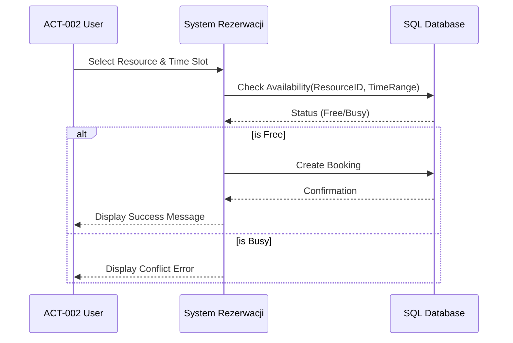
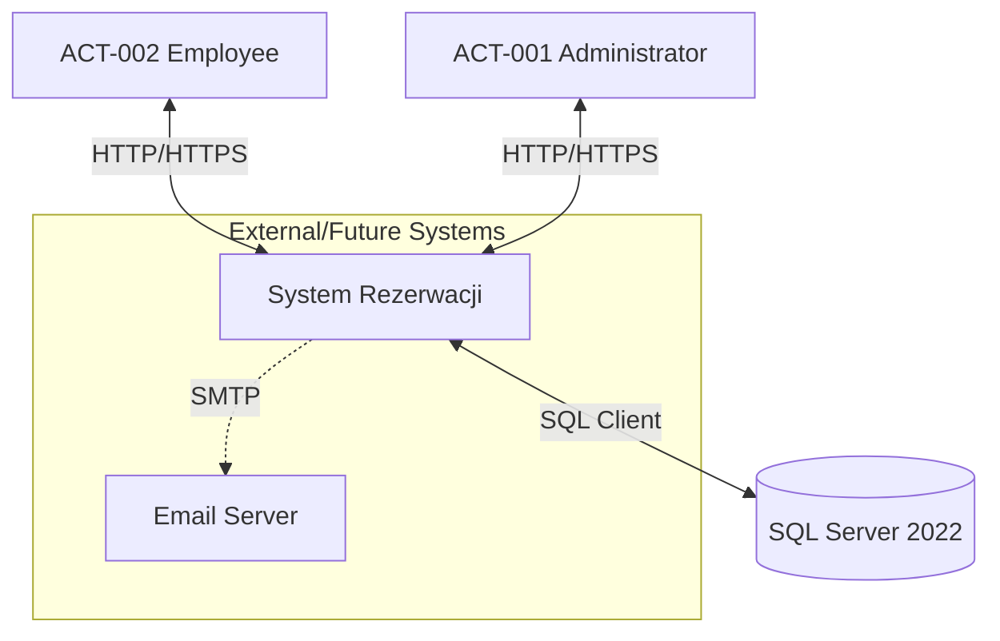

# System Rezerwacji - Requirements specification

**Metryka:**
*   **Version:** 3.4
*   **Date of creation:** 2026-01-18
*   **Date last modified:** 2026-01-18
*   **Authors:** AI Business Architect & Patryk Przydanek & Leon Stolecki & Kacper Dombrowicz

## 1. General information

### 1.1 Description of the system
**System Rezerwacji** is a centralized, web-based platform designed to manage and optimize the allocation of shared company resources, such as conference rooms, electronic equipment, and hot desks. The system operates acting as a monolithic MVC application utilizing ASP.NET Core 8 and SQL Server, deployed via Docker containers.
The primary business goal is to eliminate scheduling conflicts (double bookings), reduce administrative overhead related to resource management, and provide employees with a transparent, self-service tools for planning work and meetings.
Key modules include:
*   **Booking Module:** An interactive calendar interface allowing users to view availability and create daily or weekly recurring reservations.
*   **Administration Module:** A dedicated panel for managing resources (images, types), users (roles, access), and system configuration.
*   **Notification System:** (Planned) Automated communication to users regarding booking status.
Security is enforced through ASP.NET Core Identity with strict role-based access control (RBAC), ensuring data integrity and authorized access.

### 1.2 Target audience
*   **Employees (Pracownicy):** The primary user base who will use the system to purely operational ends—checking availability and booking rooms or equipment for daily tasks and meetings.
*   **Office Managers / Administrators:** Responsible for maintaining the resource database, resolving rare conflicts, and managing user access. They benefit from automated controls that reduce manual dispute resolution.
*   **IT Department:** Responsible for deploying and maintaining the system. The containerized architecture simplifies their workload regarding updates and environment consistency.

### 1.3 Expected business benefits
*   **Conflict Elimination:** Automated validation logic prevents double-booking of the same resource at the same time.
*   **Time Optimization:** Employees spend less time searching for available rooms or negotiating with colleagues.
*   **Asset Utilization:** Better tracking of how resources are used, allowing for data-driven decisions on purchasing new equipment or reconfiguring office space.
*   **Accessibility:** Web-based access allows management of bookings from any device within the corporate network.

## 2. Business processes

### UC1. Creating a Resource Booking
**Actors:** User (ACT-002)
**Prerequisites:** User is logged in and is on the Calendar View.
**Main scenario:**
1.  User selects a specific Resource and a time slot (start/end) on the calendar.
2.  System validates the availability of the resource (checking for conflicts).
3.  User confirms the booking details (Title, Description, optional Recurrence).
4.  System saves the booking in the database.
5.  System displays a success message "Booking created" and renders the event on the calendar.

**Alternative Scenario:**
2a. System detects a conflict (resource already booked).
2b. System displays an error message "Conflict detected".
2c. User selects a different time slot or resource.

### UC2. Resource Management
**Actors:** Administrator (ACT-001)
**Prerequisites:** Administrator is logged in and is on the Admin Panel > Resources tab.
**Main scenario:**
1.  Administrator chooses to add a new resource.
2.  System presents a form to create a resource.
3.  Administrator fills in details (Name, Type, Description) and uploads an image.
4.  Administrator confirms creation.
5.  System displays a message confirming that the resource has been added and it becomes visible in the list.

## 3. Actors

| Code | Description | Attributes |
| :--- | :--- | :--- |
| **ACT-001** | **Administrator** System supervisor with full access to all modules. Can manage users, resources, and override bookings. | ID, Work Email, Password Hash, Role='Admin', LastLoginDate |
| **ACT-002** | **User (Employee)** Standard employee with permissions to view calendar, make bookings, and cancel their own bookings. | ID, Work Email, Password Hash, Role='User', Department |
| **ACT-003** | **System (Timekeeper)** Background process responsible for cleaning up old data or triggering (future) notifications. | N/A |

## 4. Business objects

| Code | Description | Relationships | Attributes |
| :--- | :--- | :--- | :--- |
| **OBJ-001** | **Resource (Zasób)** A physical item or space available for booking (e.g., Conference Room A, Projector 1). | 1:N with Bookings N:1 with ResourceType | ID, Name, Description, ImageURL, IsActive, CreatedDate |
| **OBJ-002** | **Booking (Rezerwacja)** An entity representing the reservation of a resource by a user for a specific time. | N:1 with Resource N:1 with User | ID, StartTime, EndTime, Title, Description, CreatedDate |
| **OBJ-003** | **User Profile (Użytkownik)** Account information for authentication and authorization. | 1:N with Bookings | ID, Email, PasswordHash, Roles, PhoneNumber |
| **OBJ-004** | **Resource Type (Typ Zasobu)** Categorization for resources (e.g., Room, Desk, Equipment). | 1:N with Resources | ID, Name, IconClass (FontAwesome), ColorCode |

## 5. Context diagram

The **System Rezerwacji** operates within the internal corporate network. It interfaces primarily with the **Application Database (SQL Server)** for persistent storage. While currently self-contained regarding authentication (ASP.NET Identity), it anticipates future integration with an **Email Server (SMTP)** for notifications. Users interact via Web Browsers on Desktop or Mobile devices.

## 6. Functional requirements

### 6.1 Modules
*   **A:** Authentication & Authorization Module
*   **B:** User Booking Module
*   **C:** Administration Module
*   **D:** Resource Management Module

### 6.2 Requirements

#### Module A: Authentication & Authorization
*   **A01: Login**
    As a User, I can log in to the system. For this purpose, I enter my email and password. If credentials are wrong, the system will show an error.
*   **A02: Role Access**
    As an Admin, I can access the Administration Panel. For this purpose, I click the Admin link. If I am not an Admin, the system will deny access (403 Forbidden).
*   **A03: Password Reset**
    As a Primary Admin, I can reset passwords for other users. For this purpose, I use the reset tool in the User List.

#### Module B: User Booking
*   **B01: View Calendar**
    As a User, I can see the calendar of resources. For this purpose, I navigate to the main page.
*   **B02: Create Booking**
    As a User, I can create a new booking. For this purpose, I select a free time slot and confirm. If the slot is taken, the system will show a conflict error.
*   **B03: Recurring Booking**
    As a User, I can create a recurring booking. For this purpose, I select "Daily" or "Weekly" recurrence. If any instance conflicts, the system will validate accordingly.
*   **B04: Cancel Booking**
    As a User, I can cancel my own booking. For this purpose, I click "Cancel" on the booking details. If it is not my booking, the system will hide this option.
*   **B05: Reschedule (Drag & Drop)**
    As a User, I can reschedule my booking. For this purpose, I drag the event to a new time.
*   **B06: Filter Resources**
    As a User, I can filter the calendar view. For this purpose, I select a resource type (e.g., "Projector") from the dropdown. The calendar updates to show only relevant resources.
*   **B07: Export to iCal**
    As a User, I can export my bookings. For this purpose, I click the "iCal" button. The system generates an .ics file for me to import into Outlook or Google Calendar.
*   **B08: View Booking History**
    As a User, I can see a list of my own active and past bookings. For this purpose, I navigate to the "My Bookings" tab.

#### Module C: Administration
*   **C01: User Management**
    As an Admin, I can view and block users. For this purpose, I use the User List actions.
*   **C02: Global Booking Management**
    As an Admin, I can cancel any booking. For this purpose, I use the cancel action on any user's booking.
*   **C03: Toggle Admin Role**
    As an Admin, I can promote a User to Admin (or demote). For this purpose, I toggle the "Is Admin" checkbox in the User List.
*   **C04: Unlock User Account**
    As an Admin, I can unlock a user account that was locked due to failed login attempts. For this purpose, I click "Unlock" next to the user's name.

#### Module D: Resource Management
*   **D01: Add Resource**
    As an Admin, I can add a new resource. For this purpose, I fill the resource form and upload an image.
*   **D02: Edit Resource**
    As an Admin, I can edit resource details. For this purpose, I select "Edit" on a resource.
*   **D03: Deactivate Resource**
    As an Admin, I can deactivate a resource. For this purpose, I use the soft-delete function so it disappears from the calendar.

### 6.3 Division into phases

#### Phase 1: MVP (Completed/Current v3.3)
*   User Authentication.
*   Resource CRUD (Admin).
*   Booking CRUD (Single & Recurring).
*   Conflict detection mechanisms.
*   Docker deployment.

#### Phase 2: Enhanced Interactivity & Notifications (Planned)
*   Email notifications on booking creation/cancellation.
*   Interactive editing of whole Booking Series (currently only single instances).
*   Mobile-responsive specific layout adjustments.

#### Phase 3: Integrations
*   External Calendar Sync (Outlook/Google) via iCal/API.
*   Interactive Office Map (SVG based selection).

## 7. Non-functional requirements

### Security
*   **NFR-SEC-001:** All passwords must be hashed using strong algorithms (e.g., Argon2 or PBKDF2 via ASP.NET Identity).
*   **NFR-SEC-002:** The system must enforce CSRF protection on all state-changing HTTP requests (POST/PUT/DELETE).
*   **NFR-SEC-003:** Access to Production environments must be secured via HTTPS.

### Performance
*   **NFR-PER-001:** The system should render the Calendar view in under 1.5 seconds for a dataset of up to 500 bookings.
*   **NFR-PER-002:** The system must support at least 50 concurrent users without degradation of service.

### Compatibility
*   **NFR-COM-001:** The web interface must be fully functional on modern browsers: Chrome (last 2 versions), Firefox, Edge, Safari.
*   **NFR-COM-002:** The UI must be responsive and usable on mobile devices (min. 375px width).
*   **NFR-COM-003:** The system must support **Dark Mode**. It should automatically detect system preference and allow manual toggle. The preference must be saved in `localStorage` to persist between sessions (ref: `current_state.md`).

### Architecture / Technology
*   **NFR-ARC-001:** The backend must be built using **ASP.NET Core 8** or newer.
*   **NFR-ARC-002:** The database must be **SQL Server 2019/2022** running in a Linux container.
*   **NFR-ARC-003:** The system must support "One-Command" deployment via Docker Compose.
