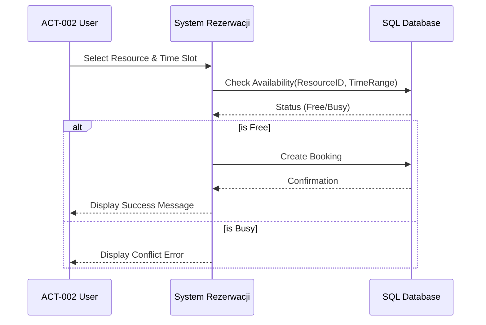
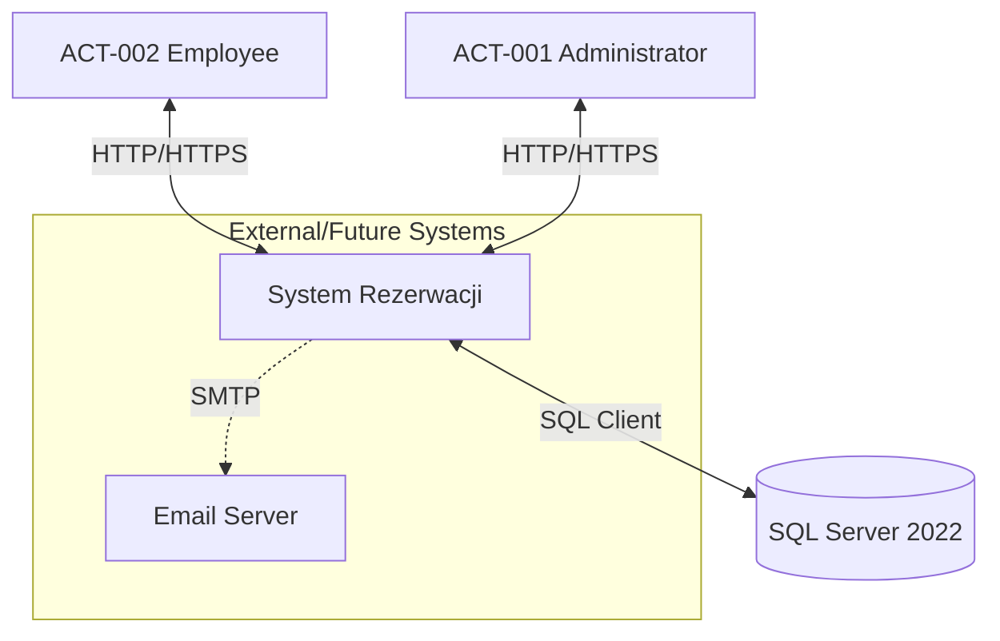

# System Rezerwacji - Requirements specification

**Metryka:**
*   **Version:** 3.4
*   **Date of creation:** 2026-01-18
*   **Date last modified:** 2026-01-18
*   **Authors:** AI Business Architect & Patryk Przydanek

## 1. General information

### 1.1 Description of the system
**System Rezerwacji** is a centralized, web-based platform designed to manage and optimize the allocation of shared company resources, such as conference rooms, electronic equipment, and hot desks. The system operates acting as a monolithic MVC application utilizing ASP.NET Core 8 and SQL Server, deployed via Docker containers.
The primary business goal is to eliminate scheduling conflicts (double bookings), reduce administrative overhead related to resource management, and provide employees with a transparent, self-service tools for planning work and meetings.
Key modules include:
*   **Booking Module:** An interactive calendar interface allowing users to view availability and create daily or weekly recurring reservations.
*   **Administration Module:** A dedicated panel for managing resources (images, types), users (roles, access), and system configuration.
*   **Notification System:** (Planned) Automated communication to users regarding booking status.
Security is enforced through ASP.NET Core Identity with strict role-based access control (RBAC), ensuring data integrity and authorized access.

### 1.2 Target audience
*   **Employees (Pracownicy):** The primary user base who will use the system to purely operational ends—checking availability and booking rooms or equipment for daily tasks and meetings.
*   **Office Managers / Administrators:** Responsible for maintaining the resource database, resolving rare conflicts, and managing user access. They benefit from automated controls that reduce manual dispute resolution.
*   **IT Department:** Responsible for deploying and maintaining the system. The containerized architecture simplifies their workload regarding updates and environment consistency.

### 1.3 Expected business benefits
*   **Conflict Elimination:** Automated validation logic prevents double-booking of the same resource at the same time.
*   **Time Optimization:** Employees spend less time searching for available rooms or negotiating with colleagues.
*   **Asset Utilization:** Better tracking of how resources are used, allowing for data-driven decisions on purchasing new equipment or reconfiguring office space.
*   **Accessibility:** Web-based access allows management of bookings from any device within the corporate network.

## 2. Business processes

### Process 1: Creating a Resource Booking
A standard process where an employee reserves a specific room or desk for a defined time slot.

**Use Case:**
*   **Actor:** ACT-002 (Generic User)
*   **Main Scenario:**
    1.  User logs into the system.
    2.  User navigates to the Calendar View.
    3.  User selects a specific Resource and a time slot (start/end).
    4.  System validates the availability of the resource.
    5.  User confirms the booking.
    6.  System saves the booking and displays success confirmation.
*   **Alternative Scenario:**
    4a. System detects a conflict (resource already booked).
    4b. System displays an error message and refreshes the calendar view.
    4c. User selects a different time slot or resource.

### Process 2: Resource Management (Admin)
The process of adding or updating company assets available for booking.

**Use Case:**
*   **Actor:** ACT-001 (Administrator)
*   **Main Scenario:**
    1.  Admin logs into the Admin Panel.
    2.  Admin selects "Resources" tab.
    3.  Admin clicks "Add New Resource".
    4.  Admin fills in details (Name, Type, Description) and uploads an image.
    5.  System saves the new resource to the database.
    6.  Resource becomes immediately visible on the Calendar.

## 3. Actors

| Code | Description | Attributes |
| :--- | :--- | :--- |
| **ACT-001** | **Administrator** System supervisor with full access to all modules. Can manage users, resources, and override bookings. | ID, Work Email, Password Hash, Role='Admin', LastLoginDate |
| **ACT-002** | **User (Employee)** Standard employee with permissions to view calendar, make bookings, and cancel their own bookings. | ID, Work Email, Password Hash, Role='User', Department |
| **ACT-003** | **System (Timekeeper)** Background process responsible for cleaning up old data or triggering (future) notifications. | N/A |

## 4. Business objects

| Code | Description | Relationships | Attributes |
| :--- | :--- | :--- | :--- |
| **OBJ-001** | **Resource (Zasób)** A physical item or space available for booking (e.g., Conference Room A, Projector 1). | 1:N with Bookings N:1 with ResourceType | ID, Name, Description, ImageURL, IsActive, CreatedDate |
| **OBJ-002** | **Booking (Rezerwacja)** An entity representing the reservation of a resource by a user for a specific time. | N:1 with Resource N:1 with User | ID, StartTime, EndTime, Title, Description, CreatedDate |
| **OBJ-003** | **User Profile (Użytkownik)** Account information for authentication and authorization. | 1:N with Bookings | ID, Email, PasswordHash, Roles, PhoneNumber |
| **OBJ-004** | **Resource Type (Typ Zasobu)** Categorization for resources (e.g., Room, Desk, Equipment). | 1:N with Resources | ID, Name, IconClass (FontAwesome), ColorCode |

## 5. Context diagram

The **System Rezerwacji** operates within the internal corporate network. It interfaces primarily with the **Application Database (SQL Server)** for persistent storage. While currently self-contained regarding authentication (ASP.NET Identity), it anticipates future integration with an **Email Server (SMTP)** for notifications. Users interact via Web Browsers on Desktop or Mobile devices.

## 6. Functional requirements

### 6.1 Modules
*   **A:** Authentication & Authorization Module
*   **B:** User Booking Module
*   **C:** Administration Module
*   **D:** Resource Management Module

### 6.2 Requirements

#### Module A: Authentication & Authorization
*   **REQ-A-001:** The system must allow users to log in using an email and password.
*   **REQ-A-002:** The system must support role-based access control (Admin, User).
*   **REQ-A-003:** The system must strictly deny access to Administration pages for non-admin users.
*   **REQ-A-004:** The system must allow the Primary Admin to reset passwords for other users.

#### Module B: User Booking (CRUD: Booking)
*   **REQ-B-001:** (Read) Users must be able to view the calendar with all bookings for a specific day/week/month.
*   **REQ-B-002:** (Create) Users must be able to create a new booking for a selected resource if the time slot is free.
*   **REQ-B-003:** (Create) Users must be able to create recurring bookings (daily/weekly) for up to 20 occurrences.
*   **REQ-B-004:** (Verify) The system must validate conflict detection before saving any booking (no overlaps allowed).
*   **REQ-B-005:** (Delete) Users must be able to cancel (delete) ONLY their own bookings.
*   **REQ-B-006:** (Update) Users must be able to Drag-and-Drop their own bookings to reschedule (updates time slot).

#### Module C: Administration (CRUD: User/Booking)
*   **REQ-C-001:** (Read) Admin must see a list of all registered users.
*   **REQ-C-002:** (Update) Admin must be able to grant or revoke Administrator privileges.
*   **REQ-C-003:** (Update) Admin must be able to lock/unlock user accounts.
*   **REQ-C-004:** (Delete) Admin must be able to cancel ANY booking in the system.

#### Module D: Resource Management (CRUD: Resource)
*   **REQ-D-001:** (Create) Admin must be able to add new resources with Name, Type, and optional Image.
*   **REQ-D-002:** (Update) Admin must be able to edit resource details.
*   **REQ-D-003:** (Delete/Soft Delete) Admin must be able to deactivate a resource so it no longer appears for new bookings but preserves history.
*   **REQ-D-004:** (Read) Users and Admins can filter resources by Type (Room, Desk, etc.).

### 6.3 Division into phases

#### Phase 1: MVP (Completed/Current v3.3)
*   User Authentication.
*   Resource CRUD (Admin).
*   Booking CRUD (Single & Recurring).
*   Conflict detection mechanisms.
*   Docker deployment.

#### Phase 2: Enhanced Interactivity & Notifications (Planned)
*   Email notifications on booking creation/cancellation.
*   Interactive editing of whole Booking Series (currently only single instances).
*   Mobile-responsive specific layout adjustments.

#### Phase 3: Integrations
*   External Calendar Sync (Outlook/Google) via iCal/API.
*   Interactive Office Map (SVG based selection).

## 7. Non-functional requirements

### Security
*   **NFR-SEC-001:** All passwords must be hashed using strong algorithms (e.g., Argon2 or PBKDF2 via ASP.NET Identity).
*   **NFR-SEC-002:** The system must enforce CSRF protection on all state-changing HTTP requests (POST/PUT/DELETE).
*   **NFR-SEC-003:** Access to Production environments must be secured via HTTPS.

### Performance
*   **NFR-PER-001:** The system should render the Calendar view in under 1.5 seconds for a dataset of up to 500 bookings.
*   **NFR-PER-002:** The system must support at least 50 concurrent users without degradation of service.

### Compatibility
*   **NFR-COM-001:** The web interface must be fully functional on modern browsers: Chrome (last 2 versions), Firefox, Edge, Safari.
*   **NFR-COM-002:** The UI must be responsive and usable on mobile devices (min. 375px width).

### Architecture / Technology
*   **NFR-ARC-001:** The backend must be built using **ASP.NET Core 8** or newer.
*   **NFR-ARC-002:** The database must be **SQL Server 2019/2022** running in a Linux container.
*   **NFR-ARC-003:** The system must support "One-Command" deployment via Docker Compose.
